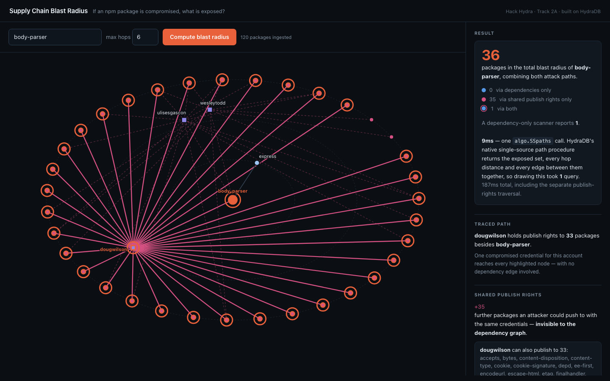
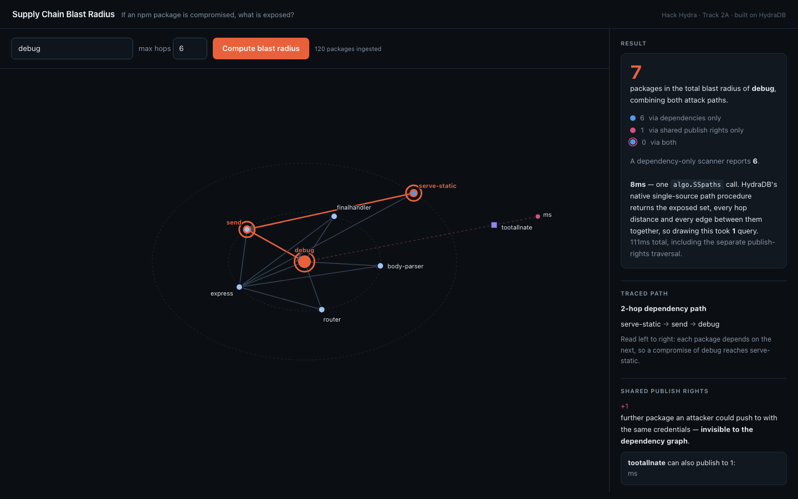

# Supply Chain Blast Radius

Hack Hydra 2026 submission — Track 2, Option A ("Repos, Dependencies + Code as Graphs").

**The question:** if an npm package is compromised right now, what's exposed? This project builds the npm dependency graph in [HydraDB](https://github.com/hydra-db/hydradb) and answers that with a graph traversal — not a guess, not a vector search.

## Why this is a graph problem, and what HydraDB does here

A compromise spreads two ways, and they are different relationships in the graph:

1. **Through code you pull in** — the dependency tree. `(dependent)-[:DEPENDS_ON]->(dependency)`.
2. **Through credentials that can push code to you** — shared publish rights. `(package)-[:MAINTAINED_BY]->(maintainer)`.

Scanners model the first. The incident the track brief opens with was the second: the TanStack worm published 84 malicious artifacts across 42 packages in six minutes through compromised *publish access*, and those packages did not depend on each other. Modelling both as first-class edges and reporting their union is the core idea here.

The gap is not academic. On the demo graph:

| Package | Exposed via dependencies | Reachable via shared publish rights | **Total blast radius (union)** |
|---|---|---|---|
| `body-parser` | 1 | 36 | **36** |
| `qs` | 2 | 8 | **10** |
| `debug` | 6 | 1 | **7** |

`body-parser` looks nearly harmless through a dependency lens — **1** exposed package. Widen to publish rights and **36** packages are in range of the same credentials, **35 of them invisible to dependency scanning entirely**. The UI leads with the union for exactly this reason, and shows the per-channel split underneath so the number stays honest.



*Clicking the maintainer `dougwilson` lights up everything one stolen credential reaches. The small orange core is the entire dependency blast radius; every other node is invisible to a dependency scanner. Both channels are drawn — squares are maintainers, dashed edges are publish rights.*

**Why a graph database rather than a table or a vector index.** The dependency answer is a transitive closure of unbounded depth — a self-join repeated until fixpoint in SQL, one traversal here. The publish-rights answer is a two-hop walk *across two different edge types* (`MAINTAINED_BY` then `MAINTAINS`). Neither is a similarity question, so an embedding index cannot answer either one: "which packages are semantically similar to `qs`" is not "which packages break when `qs` breaks."

**The whole picture is one query.** The exposed set, every package's hop distance, and every edge between them all come back from a single call to HydraDB's native single-source path procedure:

```cypher
CALL algo.SSpaths({sourceNode: $sourceNode, relTypes: ["REQUIRED_BY"], maxLen: 6, pathCount: 2000})
YIELD path RETURN path
```

Because it returns *paths* rather than endpoints, one round trip carries everything a fan-out implementation has to go back and ask for — the endpoint of each path is an exposed package, its length is the hop distance, and its relationships are the edges. `src/blastRadius.js` keeps the portable variable-length-`MATCH` version as `blastRadiusFanout()` and falls back to it automatically if the procedure is unavailable or hits its path cap, so the demo still runs against a build without it. The two produce **identical node sets, edge sets and hop distances** on every package in the demo graph — verified, not assumed:

| Target | Native | Fan-out fallback | End-to-end speedup |
|---|---|---|---|
| `debug` | **1 query** | 10 queries | **29x** |
| `qs` | **1 query** | 5 queries | **13x** |
| `send` | **1 query** | 5 queries | **16x** |
| `body-parser` | **1 query** | 4 queries | **15x** |

*Measured on the 120-package demo graph `./setup.sh` builds. It does not hold at every scale, and the reason is worth reading before trusting the number: see [the path ceiling](#the-path-ceiling-and-why-the-fast-path-is-not-always-the-right-one).*

Calling it at all took some finding, and both discoveries are the kind that cost an afternoon:

- The request field is **`parameters`**, not `params`. A field named `params` is accepted by the transport and silently ignored, so the server answers `missing OpenCypher query parameter $sourceNode` while the parameter is sitting in the request body.
- **Only scalars bind.** `sourceNode` *must* be a bound parameter and `relTypes` *must not* be — a list parameter is rejected with `composite parameter is only supported as an UNWIND input`.

**Engaging with the engine's real limits.** Three further constraints were found the same way, and each one visibly shaped the design rather than being worked around silently:

- Variable-length `MATCH` only expands **forward from a fixed source id**, so "who depends on X" is impossible as a reverse query. A mirrored `REQUIRED_BY` edge is written at ingest time so the question becomes a forward traversal. ([why](#why-the-mirrored-edge))
- Vertex identity is the integer `id` **alone — labels do not scope it**, and they accumulate. Hashing maintainer names in the same space as package names would have silently fused maintainer `ljharb` with a package named `ljharb`. Ids are namespaced per type. ([why](#why-vertex-ids-are-hashed-and-namespaced))
- A relationship pattern may name **exactly one type** — `[:REQUIRED_BY|MAINTAINS*1..3]` is rejected outright. So the two channels genuinely cannot be walked in one traversal; they are queried separately and unioned in `src/server.js`. That is a design consequence, not a shortcut.

### The path ceiling, and why the fast path is not always the right one

`algo.SSpaths` **silently caps at 1024 paths**, whatever you ask for. Requesting 100, 500 or 1000 returns exactly that many; requesting 2000, 5000 or 20000 all return exactly 1024. It is not documented and there is no flag, warning, or truncation marker in the response — the reply to a saturated query is shaped exactly like the reply to a complete one.

That matters far more here than a missing feature would, because this returns *paths*, and path count grows combinatorially with graph density while the answer we want — the exposed set — grows linearly. So the ceiling is reached long before the graph is large, and **the failure mode is a blast radius that is quietly too small.** Measured on a 1,024-package graph built from a dozen real roots:

| Target | Reported by the native path | Actually exposed | Silently missing |
|---|---|---|---|
| `chalk` | 68 | **89** | 21 packages |
| `tslib` | 72 | **84** | 12 packages |
| `semver` | 109 | **120** | 11 packages |

For a security tool that is the worst failure available: under-reporting exposure reads exactly like safety. `src/blastRadius.js` therefore requests **exactly the ceiling** and treats a full-ceiling response as *possibly truncated*, falling back to the exhaustive variable-length traversal — which has no such cap — whenever it sees one. The fast path is used only where it is provably complete, and every target above now returns the full set. (Asking for more than the ceiling is what makes saturation undetectable: request 2000, receive 1024, and a "did we hit the cap?" check comparing against 2000 can never fire. That was the bug, and it was found by testing at scale rather than by reading the docs.)

The consequence is worth stating plainly, because it cuts against the speedup table above: **on a large graph the popular packages — the ones whose blast radius you most want — are exactly the ones that fall back to the slower, exhaustive path.** The single-query result is real, and it is what the demo graph runs on; it is not a claim about every graph.

**Proof the traversal is correct.** `src/eval.js` computes the blast radius independently by BFS over the raw edge list in memory, with no HydraDB involved, then asks HydraDB the same question and diffs the two sets: **1.00 precision and 1.00 recall** on every target. This is a correctness gate on the ingest → store → traverse round trip, not a vulnerability-detection accuracy score — the distinction matters and is spelled out in [the eval section](#correctness-eval).

**And proof the data itself is right.** That gate has a real limit: its ground truth is derived from this project's own crawl, so a crawler that learned the wrong edges would be graded against its own mistake and still score 1.00. `src/evalExternal.js` closes that loop by scoring against **deps.dev (Google's Open Source Insights)** — an independently resolved dependency graph for npm, built by Google's resolver with no connection to this crawler. Inverting its forward closures gives a true external answer to "who depends on X", and against it this project scores **recall 1.00, mean precision 0.94** — and every point of that precision gap is attributed by name, not hand-waved: it is `minimizer-webpack-plugin` reaching those targets through its `webpack` **peerDependency**, an edge this graph models deliberately (a compromised peer runs in your build exactly like a compromised dependency) and an install closure does not walk. See [validation against an independent source](#validation-against-an-independent-source).

**And the graph shows its work.** Click any node and the exact chain that exposes it lights up, reconstructed from the edges the traversal already returned — clicking `serve-static` on a `debug` blast radius traces `serve-static → send → debug`, each package depending on the next. Click a package reachable only through credentials and it says so explicitly, naming every maintainer who can publish to both it and the target. Click a maintainer and its entire publish reach lights up at once. Membership is the weak claim; the path is the evidence.



## Quick start

```bash
./setup.sh
```

That's the whole setup. It starts HydraDB, waits for it to accept queries, ingests a real npm dependency graph from the public registry, and serves the UI at `http://127.0.0.1:8787`. **Cold start to working UI is about 16 seconds**; re-running reuses what's already there and comes up in ~2s. Requires Docker and Node 18+ — the script checks both and tells you exactly what to do if either is missing. `./setup.sh --fresh` wipes the database and starts over.

> **Clone somewhere under your home directory.** HydraDB writes its store to a bind-mounted `hydradb-data/` as your own user, so the repo has to sit on a path your Docker VM shares writably. Some `/tmp` locations are mounted read-only or as root (this bites under Colima), and Docker Desktop only shares the directories in its File Sharing list. If you hit it, setup stops in about two seconds and says so explicitly rather than leaving you guessing.

Once it's up, try **`body-parser`**: one package exposed through dependencies, ~36 through shared publish rights. That gap is the point of the project.

## Status

Working end-to-end, including the demo UI. Of the six questions the track brief asks a submission to answer when a package is compromised, this answers four:

| Brief's question | Status |
|---|---|
| What is the complete blast radius? | ✅ `src/blastRadius.js` |
| Which services are transitively exposed? | ✅ `src/blastRadius.js`, reported with hop distance |
| Which packages share maintainers with it? | ✅ `src/sharedMaintainers.js` |
| Are there likely typosquats nearby? | ✅ `src/typosquat.js` |
| Which version introduced the vulnerability? | ❌ graph is version-less today |
| Which apps resolved the bad version while live? | ❌ needs lockfile ingestion |

The two gaps share one cause and one fix: the graph models packages, not versions. Adding `(:Package)-[:HAS_VERSION]->(:Version)` and ingesting lockfiles would answer both, and it is the obvious next edge type. That was a deliberate trade — the second *attack channel* (publish rights) was worth more than a second *dimension* on the channel already modelled, because the incident the brief opens with spread through credentials, and no amount of version resolution would have caught it.

Plus a correctness eval (independently-computed ground truth vs. HydraDB's own traversal, cross-referenced against real OSV advisories) and a zero-dependency API + browser visualization (`node src/server.js`, then `http://127.0.0.1:8787`).

### Running the demo UI

```bash
node src/server.js --port=8787
```

Then open `http://127.0.0.1:8787`, type a package name that's already in the graph (the input autocompletes from `/api/packages`), and click "Compute blast radius". Try `body-parser`, `qs`, or `debug`.

**Both attack channels are drawn in one picture.** Circles are packages, coloured by hop distance; squares are maintainers — a different shape because they are a genuinely different vertex type in the graph. Solid arrows are dependency edges; dashed red edges are publish rights. Packages sitting on the outermost ring in red are reachable *only* through credentials: a dependency scanner reports none of them. A package already in the dependency tree that is *also* in credential range gets a dashed halo, because it is exposed twice over.

**Then click something.** Clicking a package traces the exact chain that exposes it — clicking `serve-static` on a `debug` radius lights up `serve-static → send → debug` and spells it out in the sidebar. Clicking a credential-only package says so explicitly and names every maintainer who can publish to both it and the target. Clicking a maintainer lights up its entire publish reach at once. All of it is reconstructed from data the blast-radius response already carried, so every interaction costs zero additional queries.

**Demo-ready example:** `./setup.sh` ingests `express --depth=4 --max-nodes=250` and `webpack --depth=3 --max-nodes=150` into one graph — **120 real packages**, including [`qs`](https://github.com/advisories?query=qs), which has 7 real GHSA advisories (prototype pollution, DoS). `node src/blastRadius.js qs` correctly returns `body-parser` and `express` as exposed, via the real `express -> body-parser -> qs` dependency chain — a genuine incident, not a synthetic example.

It also ingests `expres` — a real package someone published to npm, a genuine typosquat of `express` with ~6k weekly downloads against express's ~127M — so the typosquat scanner has an actual positive to find rather than an empty result. Nothing about it is synthetic; it is a squatted name that really exists.

**Deep links.** Any view is addressable, which makes a specific finding quotable rather than a list of steps to reproduce:

```
http://127.0.0.1:8787/?pkg=body-parser&maintainer=dougwilson   one credential's whole reach
http://127.0.0.1:8787/?pkg=debug&trace=serve-static            the chain that exposes a package
```

### The second attack path: shared publish rights

```bash
node src/sharedMaintainers.js body-parser
```

A dependency-only blast radius answers "what pulls this code in". It does not answer "who else can push code here" — and in the incident the track brief opens with, that was the actual vector: the TanStack worm published 84 malicious artifacts across 42 packages in six minutes through compromised *publish access*. Those packages did not depend on each other. They shared a credential.

So the graph also models `(:Package)-[:MAINTAINED_BY]->(:Maintainer)` (mirrored as `MAINTAINS`), and asks the question as a two-hop traversal across two different edge types:

```cypher
MATCH (target:Package {id: <id>})-[:MAINTAINED_BY]->(m:Maintainer)-[:MAINTAINS]->(sibling:Package)
RETURN m.name, sibling.name
```

The gap between the two answers is the point, and it is measured at the top of this README: `body-parser` exposes **1** package through dependencies and **36** through publish rights — **35** of them reachable by no dependency edge at all.

> Note: this models *blast radius*, not wrongdoing. These are the legitimate maintainers of widely-used packages; the point is that their credentials are a high-value target, which is what makes the exposure worth measuring.

### Correctness eval

```bash
node src/eval.js koa --depth=3 --max-nodes=200
```

The track brief scores on precision, recall, query latency and cost against OSV / GitHub Advisory ground truth. Since the organizers' held-out harness isn't available to entrants, `src/eval.js` builds the strongest self-check available: it crawls a dependency tree, computes the blast radius **independently** by BFS over the raw edge list in memory (no HydraDB involved), then asks HydraDB's `REQUIRED_BY` traversal the same question and compares the two sets — reporting precision, recall, F1 and per-query latency, with each target cross-referenced against its real OSV advisory count.

The two methods should agree exactly; they currently do, at **1.00 precision and 1.00 recall** on every target, with traversals answering in 8–44ms:

```
target               truth   hydra   P      R      F1     ms     OSV advisories
fresh                1       1       1.00   1.00   1.00   44     1
negotiator           2       2       1.00   1.00   1.00   9      1
mime-types           3       3       1.00   1.00   1.00   9      0
statuses             3       3       1.00   1.00   1.00   9      0
http-errors          2       2       1.00   1.00   1.00   8      0
```

Targets are chosen to make the table say something. Ranking purely by in-degree picks the biggest blast radii, but the most-depended-upon packages in a typical npm tree are stable low-level utilities that have never had an advisory — which made the OSV column print all zeros on every run and look like a dead integration. So a wider slice is ranked by in-degree, packages carrying real advisories are preferred, and the rest is backfilled by in-degree.

**What this proves, and what it does not.** It is a correctness gate on the ingest → store → traverse round trip: it answers *"does HydraDB return exactly the set that is actually reachable in the graph we wrote."* It is **not** a measure of vulnerability-detection accuracy against OSV/GHSA. The ground truth is a BFS over the same edge list that was just written, so the score can only drop if ingestion or traversal is broken — which makes it a strong regression test and a deliberately weak accuracy claim. Measuring true detection accuracy needs the organizers' held-out advisory set, which entrants don't have.

Run it against a **freshly reset** database: HydraDB accumulates everything previously ingested (correct behavior for a real ecosystem graph — more history means more complete answers), but the in-memory ground truth only knows the current crawl, so extra correct matches from earlier ingests would read as false precision loss.

### Validation against an independent source

```bash
node src/evalExternal.js
```

The eval above has a limit worth naming: its ground truth is a BFS over the same edge list this project just wrote, so it can only catch a broken *round trip*. If the crawler learned the wrong edges, both sides are wrong together and the score is still a confident 1.00.

This script grades the data instead of the plumbing. Ground truth comes from **[deps.dev](https://deps.dev)**, Google's Open Source Insights — a fully resolved transitive dependency graph for npm, produced by Google's own resolver with no connection to this crawler. deps.dev answers the forward question ("what does `P` depend on"), so the closures are inverted to produce the reverse one this project answers:

```
externalDependents(X) = { P in graph : X ∈ depsdev_closure(P) }
```

On the demo graph, against 118 independently resolved closures:

| Target | deps.dev | HydraDB | P | R | OSV advisories |
|---|---|---|---|---|---|
| `ms` | 7 | 7 | 1.00 | **1.00** | 2 |
| `debug` | 6 | 6 | 1.00 | **1.00** | 4 |
| `@xtuc/long` | 10 | 11 | 0.91 | **1.00** | 0 |
| `@webassemblyjs/floating-point-hex-parser` | 9 | 10 | 0.90 | **1.00** | 0 |
| `@webassemblyjs/helper-api-error` | 9 | 10 | 0.90 | **1.00** | 0 |

**Recall is 1.00 — nothing an independent resolver knows to be exposed is ever missed.** That is the number that matters for a security tool: a missed dependent is an unreported compromise.

Precision is 0.94, and the script does not wave at the gap — it attributes every case with evidence. All of it is one package, `minimizer-webpack-plugin`, reaching those targets through its `webpack` **peerDependency**. `src/ingest.js` merges `peerDependencies` into the dependency edges on purpose: a plugin that peers on `webpack` runs alongside whatever `webpack` ships, so a compromised peer is exactly as dangerous as a compromised dependency. deps.dev reports an *install* closure, where peers are not pulled in transitively. So this project deliberately reports more, and the script says which package, which peer edge, and why, rather than filing it under "version skew" and hoping.

Two sources of disagreement are separated and labelled rather than folded into the headline number: dependents deps.dev knows that a bounded crawl (`--depth`/`--max-nodes`) never ingested are a **collection** limit, not a traversal miss; dependents this graph has that deps.dev's single resolved version does not are peer edges or version skew, distinguished by checking the manifest.

### On the latency numbers

The UI reports two figures, deliberately kept apart. **`coreQueryMs`** is the single `algo.SSpaths` call that answers "what is exposed" and returns the shape needed to draw it — typically 4–6ms warm on the demo graph, and the only number that should be read as HydraDB's query speed. That figure is scale-dependent, and honestly so: on the 1,024-package graph described under [the path ceiling](#the-path-ceiling-and-why-the-fast-path-is-not-always-the-right-one) the same call runs 400–1300ms, because the work is proportional to the number of *paths* enumerated rather than to the size of the answer. **`totalMs`** additionally covers the existence check and the separate publish-rights traversal, which is a genuinely different question against a different edge type. The UI also names which engine path answered, because that is not cosmetic: on the fallback, `coreQueryMs` covers only the first of several queries and `totalMs` also absorbs hop-distance probes and per-package edge lookups that exist *only to draw the graph*. Those were never folded into a single flattering number, and now that the native procedure removes them entirely, the honest comparison is still on the record above.

### On cost

The brief's fourth eval axis, alongside precision/recall/latency. There's no metered bill to report here — this runs against a self-hosted, single-node alpha image with no usage-based pricing exposed — so the honest proxy is query cost, not dollar cost: **one `algo.SSpaths` call replaces up to 10 fan-out queries** (measured 13–29x fewer round trips end-to-end; see the table above), and that reduction is exactly what a metered deployment would bill for, since HydraDB's storage/compute-disaggregated architecture prices on requests against the object store, not on data volume held. The other place cost shows up is ingest: `src/typosquat.js` deliberately uses a static `POPULAR_PACKAGES` reference list rather than a live popularity API call per candidate, and `src/ingest.js` bounds every crawl with `--depth`/`--max-nodes` — both are cost controls as much as they are demo-stability controls.

### Typosquat detection

`node src/typosquat.js` scans every package name currently in the graph, flags anything within edit distance 2 of a popular reference package (`src/typosquat.js`'s `POPULAR_PACKAGES`), and confirms suspicion using live npm weekly download counts — a genuine typosquat has far fewer downloads than the package it resembles. On the demo graph:

```
[HIGH] "expres" (distance 1 from "express") — 6,186 weekly downloads vs 127,296,948
       for "express" (0.005% of "express"'s downloads)
```

This is deliberately two-signal, because each signal alone is wrong in a different way:

- **Edit distance alone over-reports.** `isarray` is a real, independently popular package one edit from `is-array` — and has *more* downloads than it. The ratio reclassifies it as "likely coincidence" instead of flagging it.
- **Absolute distance is meaningless on short names.** `ms` is one edit from `qs`, and `acorn` is two from `cors`; neither has anything to do with impersonation. Distance must also be small *relative* to name length (≤ 0.34), which drops both while keeping `expres`/`express` and `reqeusts`/`request`.

The panel leads with the verdict rather than the raw candidate list, since the count that matters is how many survived both filters.

## How HydraDB is used

The graph has two vertex types and four edge types:

- `(dependent:Package)-[:DEPENDS_ON]->(dependency:Package)` — the natural direction
- `(dependency)-[:REQUIRED_BY]->(dependent)` — the reverse, written at ingest time
- `(package)-[:MAINTAINED_BY]->(maintainer:Maintainer)` — publish rights
- `(maintainer)-[:MAINTAINS]->(package)` — the reverse, likewise

The blast-radius question is asked two ways against the same model, and both are forward walks over `REQUIRED_BY` from the compromised package.

The primary path is HydraDB's native single-source path procedure, which returns whole paths and so answers the exposure question and supplies the drawing in one round trip:

```cypher
CALL algo.SSpaths({sourceNode: $sourceNode, relTypes: ["REQUIRED_BY"], maxLen: 6, pathCount: 2000})
YIELD path RETURN path
```

The portable fallback is a variable-length traversal, used when the procedure is unavailable or its path cap is reached:

```cypher
MATCH (target:Package {id: <id>})-[:REQUIRED_BY*1..6]->(dependent:Package)
RETURN DISTINCT dependent.name
```

This is the core "why HydraDB" of the project: computing everything transitively exposed by a compromise is a multi-hop graph traversal, not something a vector index or a flat table can answer — and the engine has a purpose-built procedure for exactly that traversal, which is why the answer costs one query rather than ten.

### Why vertex ids are hashed and namespaced

HydraDB keys vertices on `id` alone — **the label does not scope identity**, and labels accumulate. MERGE-ing a `:Package` onto an id already held by a `:Maintainer` silently overwrites that vertex's properties and leaves a single vertex answering to both labels while carrying both sets of edges (verified against the running node). Since `id` must be an integer, names are hashed — and because npm users routinely publish a package under their own handle, maintainer ids are hashed in a **separate namespace** (`maintainerId()` in `src/hydra.js`). Without that, maintainer `ljharb` and a package named `ljharb` would fuse into one vertex with certainty.

### Why the mirrored edge

HydraDB's current MERGE/traversal implementation only expands **forward** from a vertex with a known, fixed `id` — a variable-length `MATCH` into a fixed target (`(a)<-[:DEPENDS_ON*]-(b)` style reverse queries) errors with `variable-length MATCH requires a fixed source id`. Since blast-radius is inherently "who points at X", the dependency edge is mirrored at write time so the traversal can run forward from the known target along `REQUIRED_BY` instead. See `src/hydra.js` and `src/ingest.js` for the full detail — this constraint (and several other Cypher-subset quirks) was found by direct trial against the local dev node; the vertex `id` must also be an integer, so package names are hashed to stable ids (`packageId()` in `src/hydra.js`).

## Setup, step by step

`./setup.sh` above does all of this for you. This section is the manual equivalent, for anyone who wants to see what it does or run the pieces separately. Requires Docker (or a Docker-compatible daemon like [Colima](https://github.com/abiosoft/colima)) and Node.js 18+.

1. Start HydraDB locally:

   ```bash
   mkdir -p hydradb-data/store hydradb-data/cache
   printf '%s\n' 'local-development-token-32-bytes' > hydradb-data/auth-token
   docker run -d --name hydradb --platform linux/amd64 \
     --user "$(id -u):$(id -g)" \
     -p 7687:7687 -p 8443:8443 -p 9090:9090 \
     -v "$PWD/hydradb-data:/data" \
     -e CLOUD_PROVIDER=local \
     -e LOCAL_PATH=/data/store \
     -e GRAPH_NAMESPACE=default \
     -e GRAPH_ID=default \
     -e GRAPH_CELL_ID=cell-0 \
     -e GRAPH_CELLS=cell-0 \
     -e GRAPH_NODE_ID=node-0 \
     -e GRAPH_DATA_CACHE_DIR=/data/cache \
     -e GRAPH_AUTH_TOKEN_FILE=/data/auth-token \
     -e GRAPH_ALLOW_PLAINTEXT=true \
     -e RUST_MIN_STACK=33554432 \
     ghcr.io/hydra-db/hydradb:latest
   ```

2. Ingest a package's dependency tree:

   ```bash
   node src/ingest.js express --depth=3 --max-nodes=150
   ```

3. Query its blast radius, or any package discovered during ingestion:

   ```bash
   node src/blastRadius.js debug
   ```

## Dependencies / data sources

- Package metadata: the public [npm registry](https://registry.npmjs.org) (no auth, no API key).
- Download counts for typosquat confirmation: the public [npm downloads API](https://api.npmjs.org).
- Vulnerability ground truth in the eval: the public [OSV API](https://api.osv.dev), which serves GitHub Advisory Database records.
- **No third-party libraries at all** — ingestion, querying, the HTTP server and the frontend run on Node's built-in `fetch`/`node:http` and vanilla browser JS. There is no build step, no bundler, and no CDN request, and `npm install` is not required (there are no dependencies to install). The only setup is `./setup.sh`, which also starts HydraDB and loads the demo graph — `node src/server.js` on its own needs a HydraDB instance already running with data in it.

## License

MIT — see [LICENSE](LICENSE).
